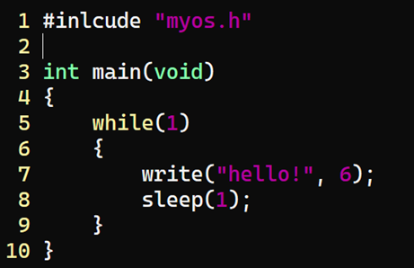
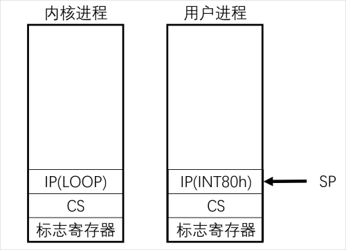
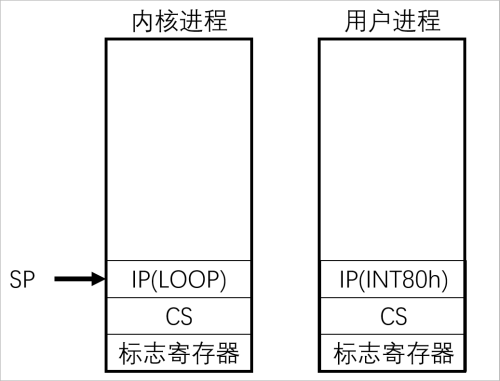
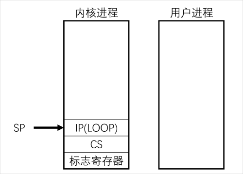

# Simple-Syscall-Implemented-In-C-and-Assembly
nasm assembly is used to implement a simple OS kernel to realize C program calling kernel functions

## 一、实验要求

本次实验分为OS内核、API库、示范应用三个部分，为综合性实验项目（建议合理构造代码目录结构，采用makefile组织和管理整个实验项目的编译、部署和运行）：

1. 采用nasm汇编语言实现一个实验性质的OS内核并部署到MBR，主要功能如下：

   1. 实现write内核函数，向屏幕输出指定长度的字符串（尽量保证每次输出另起一行）；
   2. 实现sleep内核函数，按整型参数以秒为单位延迟（以PA3为基础实现，包括设置定时器和时钟中断处理例程）；
   3. 以系统调用的形式向外提供write和sleep两个系统服务（建议使用int 80h，也可分别以不同的用户自定义中断实现不同的系统服务，提供系统调用中断处理例程）；
   4. 内核完成初始化后，从1号逻辑扇区开始加载示范性应用程序并运行（期间当应用进程sleep时，需切换至内核的无限循环处执行，当应用进程sleep结束时，需切换回应用进程执行）。
2. 采用nasm汇编与C语言混合编程，实现一个API库

   1. 提供一个包含write和sleep函数原型的C语言头文件(建议名称myos.h)；
   2. 用nasm汇编语言实现对应的API库（封装OS内核提供的两个系统调用服务，注意在此处妥善处理示范应用32位指令与OS内核16位指令的对接！！！）。
3. 采用C语言实现一个示范应用，并部署到磁盘

   1. 采用C语言编写示范应用，用于测试OS内核功能，示范应用大致内容如下图所示（仅供参考！！！）；
   2. 采用GCC编译生成ELF32格式代码，并用objcopy等工具提取出相应的代码段和数据段，最后装入1号逻辑扇区开始的连续磁盘空间（由示范应用的大小确定）。

   

## 二、实验工具

+ 物理机操作系统：Windows 11
+ 代码编辑器：Visual Studio Code
+ Linux 环境：WSL Ubuntu20.04.6LTS
+ 虚拟机软件：QEMU (On Linux)
+ 汇编编译器：NASM 2.14.02 (On Linux)
+ C 语言编译器：GCC 9.4.0 (On Linux)

## 三、实验过程

1. 采用nasm汇编语言实现一个实验性质的OS内核并部署到MBR

   1. 实现write内核函数

      调用INT 0x10中断输出字符串。

      ```assembly
      KERNEL_WRITE:
          MOV	AX, CS                             ; 置其他段寄存器值与CS相同
          MOV	DS, AX                             ; 数据段
          MOV	BP, [SI]                           ; BP=当前字符串的偏移地址
          MOV	AX, DS                             ; ES:BP = 串地址
          MOV	ES, AX                             ; ES=DS
          MOV	CX, [SI+4]                         ; CX = 字符串长度
          MOV	AX, 0x1301
          MOV	BX, 0x0007
          MOV DH,[LINE]
          MOV DL, 0x0
          INT 0x10

          MOV AL, 0x0A                           ; 换行符的ASCII码
          MOV AH, 0x0E
          INT 0x10

          INC WORD [LINE]
          MOV AH, 0x02                           ; 功能号2表示设置光标位置
          MOV BH, 0x00                           ; 页号
          MOV DH,[LINE]
          MOV DL, 0x00                           ; 列号（0表示最左侧）
          INT 0x10

          IRET
      ```
   2. 实现sleep内核函数

      由于执行sleep时需要从应用进程切换到内核进程无限循环处执行，当应用进程sleep结束时，需切换回应用进程执行，在这里选择新建两个变量来分别存储应用进程与内核进程的SS:SP栈指针的值。

      ```assembly
      PCB_KERNEL_SP DW 0x7c00                    ;  内核进程的栈指针SP
      PCB_KERNEL_SS DW 0x7000                    ;  内核进程的栈寄存器SS
      PCB_APP_SP DW 0x7000                       ;  用户进程的栈指针SP
      PCB_APP_SS DW 0x6000                       ;  用户进程的栈寄存器SS
      ```

      当需要切换至应用进程时，将PCB_APP存储的值赋给SP；当需要切换至内核进程时，将PCB_KERNEL存储的值赋给SP；

      即在以下两种状态之间切换：

      

      

      1. 设置定时器

         ```assembly
         SET_TIMER:                                 ; 设置8253/4定时器芯片
             MOV AL, 0x36 
             OUT 0x43, AL
             MOV AX, 0x2E9C                         ; 每隔10ms产生一次时钟中断
             OUT 0x40, AL
             MOV AL, AH
             OUT 0x40, AL
             RET
         ```
      2. 设置时钟中断处理例程

         在计数器为0时，通过将IP寄存器设置为先前保存的IP的值，使其在执行IRET过后跳回应用进程执行。

         ```assembly
         CLOCK_INTERRUPT:                           ; 时钟中断处理例程
             PUSHA
             DEC WORD [TIMES_COUNTER]               ; 减少计数器的值
             MOV AL, 0x20
             OUT 0x20, AL                           ; 发送EOI命令给8259A中断控制器
             CMP WORD [TIMES_COUNTER],0
             JE SLEEP_WAKE                          ; 若计数器为0，跳回应用进程
             POPA
             IRET

         SLEEP_WAKE:
             POPA
             MOV WORD [PCB_KERNEL_SP],SP            ;  保存当前内核进程SP
             MOV WORD [PCB_KERNEL_SS],SS            ;  保存当前内核进程SS
             MOV WORD SP,[PCB_APP_SP]               ;  跳转到用户进程栈
             MOV WORD SS,[PCB_APP_SS]
             IRET
         ```
      3. sleep内核函数

         由于中断不能持续过长的时间，所以在这里选择在中断中设置计数器的大小，当计数器为0是，sleep结束。

         ```assembly
         KERNEL_SLEEP:
             MOV AX, [SI]
             MOV CX, 100                            ; 将乘数100加载到CX中
             MUL CX                                 ; 乘法运算
             MOV WORD [TIMES_COUNTER], AX           ; 设置计数器

             MOV WORD [PCB_APP_SP],SP               ;  保存当前用户进程SP
             MOV WORD [PCB_APP_SS],SS               ;  保存当前用户进程SS
             MOV WORD SP,[PCB_KERNEL_SP]            ;  跳转到内核进程
             MOV WORD SS,[PCB_KERNEL_SS]

             IRET
         ```
   3. 以系统调用的形式向外提供write和sleep两个系统服务

      1. INT 0x80中断处理

         ```assembly
         INTERUPT_HANDLER:                          ; INT 0x80中断处理
             CMP AX,1
             JE KERNEL_WRITE
             CMP AX,2
             JE KERNEL_SLEEP
             IRET
         ```
      2. 设置系统调用中断处理例程

         ```assembly
         SET_INTERRUPT:
             MOV AX, 0  
             MOV ES, AX
             MOV WORD [ES:4*0x08], CLOCK_INTERRUPT  ; 将时钟中断处理例程写入中断向量表
             MOV WORD [ES:4*0x08+2], CS
             MOV WORD [ES:4*0x80], INTERUPT_HANDLER ; 将INT 0x80中断处理例程写入中断向量表
             MOV WORD [ES:4*0x80+2], CS
             RET
         ```
   4. 加载C语言程序

      将编写的C语言程序加载到内存0x8000处运行，根据生成的C语言程序.bin文件的大小，选择拷贝10个扇区的数据到内存中。

      了解到IRET指令的功能用汇编语法描述为：

      ```assembly
      POP IP
      POP CS
      POPF
      ```

      因此当从用户进程切换回内核进程执行时，如果需要IRET则需要读取以上内容。为了使IRET后能正确跳转至无限循环处执行，在跳转到应用进程前先模仿硬件中断，将其后续执行代码的CS:IP以及标志寄存器（PSW）的值保存到栈上，如下图所示：

      

      接着通过改变SP的值，使其转变为用户进程的栈指针，从而实现切换。

      

      ```assembly
      LOADPROGRAMME:                             ; 加载C程序
          PUSHA
          MOV AX,CS                              ; 段地址
          MOV ES,AX                              ; 设置段地址
          MOV BX, 0x8000                         ; 偏移地址
          MOV AH,2                               ; 功能号
          MOV AL,10                              ; 扇区数
          MOV DL,0x80                            ; 驱动器号
          MOV DH,0                               ; 磁头号
          MOV CH,0                               ; 柱面号
          MOV CL,2                               ; 起始扇区号
          INT 0x13
          POPA

          ; 模仿硬件中断，先将后续执行代码的CS:IP以及标志寄存器（PSW）的值保存到栈上
          PUSHF
          PUSH CS
          PUSH KERNEL_LOOP

          MOV WORD [PCB_KERNEL_SP],SP            ;  保存当前内核进程SP
          MOV WORD [PCB_KERNEL_SS],SS            ;  保存当前内核进程SS
          MOV WORD SP,[PCB_APP_SP]               ;  跳转到用户进程栈
          MOV WORD SS,[PCB_APP_SS]

          JMP 0x8000                             ; 跳转到C程序执行
      ```
   5. 使用nasm编译

      ```
      nasm -f bin -o kernel.bin ./kernel/kernel.asm
      ```
2. 采用nasm汇编与C语言混合编程，实现一个API库

   1. 提供一个包含write和sleep函数原型的C语言头文件(myos.h)

      ```c
      #ifndef myos_h
      #define myos_h

      extern void write(const char* str,short len);
      extern void sleep(short sec);

      #endif
      ```
   2. 用nasm汇编语言实现对应的API库

      C语言程序中的write和sleep函数均为从左向右入栈，因此函数的第一个参数时在栈顶的，而每一个参数占4个字节，因此需要在栈顶的基础上加4。

      1. 编写write函数

         ```assembly
         write:
             PUSHA
             MOV AX,1
             MOV SI,SP                 ; 由于PUSHA会使SP增加16，因此字符串位置为16+4
             ADD SI,20
             INT 0x80
             POPA
             RETF
         ```
      2. 编写sleep函数

         ```assembly
         sleep:
             PUSHA
             MOV AX,2
             MOV SI,SP
             ADD SI,20
             INT 0x80
             POPA
             RETF
         ```
   3. 使用nasm编译

      ```
      nasm -f elf32 ./api/api.asm -o api.o
      ```
3. 采用C语言实现一个示范应用

   1. 使用C语言编写示范应用

      ```c
      #include"myos.h"
      int main(void){
          while(1){
              write("Hello,World!",12);
              sleep(1);
              write("Goodbye,World!",14);
              sleep(1);
          }
      }
      ```
   2. 采用GCC编译生成ELF32格式代码，并用objcopy提取出相应的代码段和数据段

      1. 先将.c文件通过gcc编译为.o文件

         ```
         gcc -march=i386 -m16 -I ./api -c ./app/demo.c -o demo.o 
         ```
      2. 使用gcc将编写api与C语言程序进行链接

         ```
         gcc -Wall -nostdlib -m16 -o os.o demo.o api.o
         ```
      3. 用objcopy提取出相应的代码段和数据段

         ```
         objcopy -O binary -j .text -j .data -j .rodata os.o os.bin
         ```
4. 将程序部署到磁盘

   1. 使用qemu新建一个磁盘

      ```
      qemu-img create -f raw disk.img 1M
      ```
   2. 将kernel.bin装入磁盘的第0号逻辑扇区，充当MBR的作用

      ```
      dd if=kernel.bin of=disk.img bs=512 count=1 conv=notrunc 2>/dev/null
      ```
   3. 将编写并转译完成的C语言程序装入从1号逻辑扇区开始的连续磁盘空间

      ```
      dd if=os.bin of=disk.img bs=512 seek=1 count=10 conv=notrunc 2>/dev/null
      ```
   4. 通过qemu运行虚拟磁盘

      ```
      qemu-system-x86_64 -smp sockets=1,cores=1,threads=2 -m 2048 -drive file=disk.img
      ```
5. 编写makefile，组织和管理整个实验项目的编译、部署和运行

```makefile
KERNEL_DIR = kernel
API_DIR = api
APP_DIR = app

QEMU_IMG = qemu-img
NASM_BIN = nasm
NASM_BIN_FLAGS = -f bin
NASM_ELF32_FLAGS = -f elf32
GCC = gcc
GCC_ARCH = -march=i386
GCC_BITS = -m16
GCC_INCLUDE = -I $(API_DIR)
GCC_WALL = -Wall
GCC_NOSTDLIB = -nostdlib
OBJCOPY = objcopy
OBJCOPY_FLAGS = -O binary -j .text -j .data -j .rodata
DD = dd
DD_BS = bs=512
DD_CONV = conv=notrunc 2>/dev/null
QEMU = qemu-system-x86_64
QEMU_FLAGS = -smp sockets=1,cores=1,threads=2 -m 2048

all: run

disk.img:
	$(QEMU_IMG) create -f raw disk.img 1M

kernel.bin: $(KERNEL_DIR)/kernel.asm
	$(NASM_BIN) $(NASM_BIN_FLAGS) -o kernel.bin $<

api.o: $(API_DIR)/api.asm
	$(NASM_BIN) $(NASM_ELF32_FLAGS) $< -o api.o

demo.o: $(APP_DIR)/demo.c
	$(GCC) $(GCC_ARCH) $(GCC_BITS) $(GCC_INCLUDE) -c $< -o demo.o

os.o: demo.o api.o
	$(GCC) $(GCC_WALL) $(GCC_NOSTDLIB) $(GCC_BITS) -o os.o demo.o api.o

os.bin: os.o
	$(OBJCOPY) $(OBJCOPY_FLAGS) os.o os.bin

disk.img: kernel.bin os.bin
	$(DD) if=kernel.bin of=disk.img $(DD_BS) count=1 $(DD_CONV)
	$(DD) if=os.bin of=disk.img $(DD_BS) seek=1 count=10 $(DD_CONV)

run: disk.img
	$(QEMU) $(QEMU_FLAGS) -drive file=disk.img

clean:
	rm -f *.o *.bin *.img

.PHONY: all clean run

```

编写完成后只需在终端输入make指令即可执行makefile文件中所有的指令。

## 四、实验结果

运行后，首先会先进行清屏操作，然后在屏幕上会间隔1s依次输出“Hello,World!”和“Goodbye,World!”

具体效果在gif文件有呈现


## 五、总结与思考

+ 本次实验算一次整合了前三次实验的综合性实验项目，需要用到前三次实验所使用到的技能，从MBR的编写到中断处理例程的设置。本次又新学到了该如何进行C语言和汇编的混合编译。
+ 在研究如何连接C语言文件和汇编文件时，在搜索网上资料后，一开始选择使用LD链接器，但将编译完成的文件进行反编译时，发现程序不符合要求，可能需要编写.ld的链接器脚本才可以，因此选择了网上了解到的另一种方法，采用gcc直接进行两个文件的链接。
+ 在最开始运行程序时，由于我把sleep的无限循环放在了中断处理例程之中，结果导致程序无法正常运行。在搜索资料了解到中断的调用尽量不能耗时过长，之后选择把无限循环的内容放置在了加载C语言程序之后，通过改变IP寄存器的值来改变IRET跳转的地址，使其能够跳转到无限循环处。之后与老师交流后了解到可以使用进程调度与切换的方法，通过使用不同的栈存储不同的进程，在需要跳转时加载所需进程的栈指针，以次实现了本次实验的要求。

